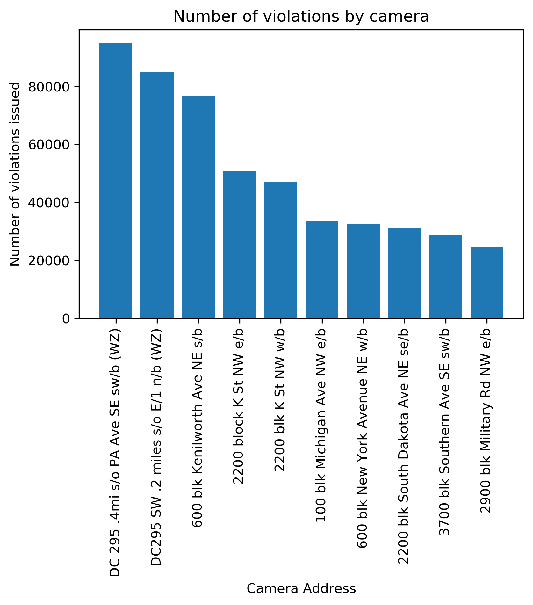

# Traffic Project
This project was authored by Carly Kelly, Yasir Omar, David Hoff, and Clementine Sraha.

The purpose of this project was to explore the relationship between socioeconomic status and traffic tickets issued by cameras in Washington D.C.

## Data Cleaning

In the "Traffic_Monthly_Data" you will find the csv files obtained from opendata.dc.gov. This containted the traffic data analyzed throughout this project.

In the "Finding_Cameras" folder you will find `Whats_A_Cam.ipynb`. In this Jupyter Notebook we determined which tickets were given by cops vs cameras. We did this by grouping the data by location and looking for large numbers of tickets for the same traffic offense.

In the file `Census_Data.ipynb` you will find how data was extracted from the Census Bureau API. The dataframe is then transformed to be used in the `Traffic_Data.ipynb`

## Running the Code

In order to run this `Traffic_Data.ipynb` you will need to enter your API keys in to the file `config.py.sample`. You will then have to resave this file as `config.py`. Run `Traffic_Data.ipynb` to generate traffic_cams_final.csv and all_data.csv.  These csv files were then read into other jupyter notebooks for analysis. You will not see the csv files in GitHub as they require too much storage. 

## Data Visualization

The remaining files contain visualizations to demonstrate the relationships between the socioeconomic factors of DC Zip codes and traffic cameras. We used matplotlib in order to create these visualizations. You can see an example below:

